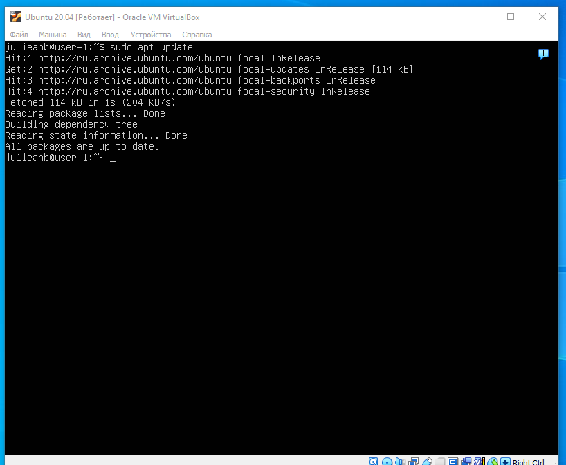

D01-Linux

## Part 1. Установка ОС

*  Графический интерфейс должен отсутствовать.
*  Узнайте версию Ubuntu, выполнив команду: `cat /etc/issue.`
*  Вставьте скриншот с выводом команды.

## Part 2. Создание пользователя

*  Вставьте скриншот вызова команды для создания пользователя.

*  Новый пользователь должен быть в выводе команды: `cat /etc/passwd`
*  Вставьте скриншот с выводом команды.

## Part 3. Настройка сети ОС

*  Задать название машины вида user-1

*  Установить временную зону, соответствующую вашему текущему местоположению.

*  Вывести названия сетевых интерфейсов с помощью консольной команды.

*  В отчёте дать объяснение наличию интерфейса lo.

lo (loopback device) – виртуальный интерфейс, присутствующий по умолчанию в любом Linux. Он используется для отладки сетевых программ и запуска серверных приложений на локальной машине. С этим интерфейсом всегда связан адрес 127.0.0.1. У него есть dns-имя – localhost. Посмотреть привязку можно в файле /etc/hosts.

*  Используя консольную команду получить ip адрес устройства, на котором вы работаете, от DHCP сервера. 

*  В отчёте дать расшифровку DHCP.

DHCP — Dynamic Host Configuration Protocol, протокол динамической конфигурации хоста. Это широковещательный протокол, позволяющий хосту получить настройки IP в автоматическом режиме без необходимости ручной настройки. В настройки входит IP-адрес, маска подсети, основной шлюз, DNS-серверы.

*  Определить и вывести на экран внешний ip-адрес шлюза (ip) и внутренний IP-адрес шлюза, он же ip-адрес по умолчанию (gw). 

*  Задать статичные (заданные вручную, а не полученные от DHCP сервера) настройки ip, gw, dns (использовать публичный DNS серверы, например 1.1.1.1 или 8.8.8.8).

*  Перезагрузить виртуальную машину. Убедиться, что статичные сетевые настройки (ip, gw, dns) соответствуют заданным в предыдущем пункте.  

* Успешно пропинговать удаленные хосты 1.1.1.1 и ya.ru и вставить в отчёт скрин с выводом команды.

## Part 4. Обновление ОС

*  После обновления системных пакетов, если ввести команду обновления повторно, должно появится сообщение, что обновления отсутствуют.
*  Вставить скриншот с этим сообщением в отчёт.

## Part 5. Использование команды sudo

*  В отчёте объяснить истинное назначение команды sudo (про то, что это слово - "волшебное", писать не стоит).

Команда sudo (substitute user and do, подменить пользователя и выполнить) позволяет строго определенным пользователям выполнять указанные программы с административными привилегиями без ввода пароля суперпользователя root.

*  Поменять hostname ОС от имени пользователя, созданного в пункте Part 2 (используя sudo).

*  Вставить скрин с изменённым hostname в отчёт.

## Part 6. Установка и настройка службы времени

*  Вывести время, часового пояса, в котором вы сейчас находитесь.
*  Вывод следующей команды должен содержать `NTPSynchronized=yes`: `timedatectl status`
*  Вставить скрины с корректным временем и выводом команды в отчёт.

## Part 7. Установка и использование текстовых редакторов 

	NANO

*  В отчёт вставьте скриншоты:

*  Из каждого редактора с содержимым файла перед закрытием.

*  Из каждого редактора с содержимым файла после редактирования.

*  Из каждого редактора с командами, введёнными для замены слова на другое.

- Для сохранения ctrl+s, для выхода ctrl+x.
- Для выхода ctrl+x и подтверждаем выход без сохранения.
- Для поиска слова и последующей замены ctrl+\ . Только поиск слова ctrl+w.

	VIM

*  В отчёт вставьте скриншоты:

*  Из каждого редактора с содержимым файла перед закрытием.

*  Из каждого редактора с содержимым файла после редактирования.

*  Из каждого редактора с командами, введёнными для замены слова на другое.

- Для сохранения и выхода :wq.
- Для выхода без сохранения :q!.
- Для поиска и замены :s/Искомое/Замена. Для поиска :s/Искомое/.

	MCEDIT

*  В отчёт вставьте скриншоты:

*  Из каждого редактора с содержимым файла перед закрытием.

*  Из каждого редактора с содержимым файла после редактирования.

*  Из каждого редактора с командами, введёнными для замены слова на другое.

- Для сохранения и выхода f2, f10.
- Для выхода без сохранения f10 и подтверждаем выход.
- Для поиска f7. Для поиска и замены f4.

## Part 8. Установка и базовая настройка сервиса **SSHD**
*  Установить службу sshd.
 
sudo apt-get install ssh

*  Добавить автостарт службы при загрузке системы.

*  Перенастроить службу SSHd на порт 2022.

*  Используя команду ps, показать наличие процесса sshd.

-С - выбирать процессы по имени команды.
*  Вывод команды netstat -tan должен содержать tcp 0 0 0.0.0.0:2022 0.0.0.0:* LISTEN

*  В отчёте объяснить значение ключей -tan, значение каждого столбца вывода, значение 0.0.0.0.

-a - Отображение всех подключений и ожидающих портов.

-t - Отображение текущего подключения в состоянии переноса нагрузки с процессора на сетевой адаптер при передаче данных ( "offload" ).

-n - Отображение адресов и номеров портов в числовом формате.

netstat -at - Перечислить все TCP порты 

proto - используемый сокетом протокол

Recv-Q – количество байтов, помещённых в буфер приёма TCP/IP, но не переданных приложению.

Send-Q – количество байтов, помещённых в буфер отправки TCP/IP, но не отправленных, или отправленных, но не подтверждённых.

Local address - локальный IP-адрес участвующий в соединении или связанный со службой, ожидающей входящие соединения (слушающей порт). 

Foreign address - Внешний IP-адрес, участвующий в создании соединения.

State - состояние соединения

Если в качестве адреса отображается 0.0.0.0 , то это означает - "любой адрес", т.е в соединении могут использоваться все IP-адреса существующие на данном компьютере.

## Part 9. Установка и использование утилит top, htop

*  По выводу команды top определить и написать в отчёте:

uptime: 31min

количество авторизованных пользователей: 1

общую загрузку системы: 0.00, 0.00, 0.00

общее количество процессов: 98

загрузку cpu: 1%

загрузку памяти: 148.9 + 352.1

pid процесса занимающего больше всего памяти: 664

pid процесса, занимающего больше всего процессорного времени: 1189

отсортированному по PID

отсортированному по PERCENT_CPU

отсортированному по PERCENT_MEM

отсортированному по TIME

отфильтрованному для процесса sshd

с процессом syslog, найденным, используя поиск

с добавленным выводом hostname, clock и uptime

## Part 10. Использование утилиты **fdisk**

написать название жесткого диска: /dev/sda

написать размер жесткого диска: 25GIB

написать количество секторов жесткого диска: 5242880

написать размер swap жесткого диска: 2.0Gi

## Part 11. Использование утилиты **df** 

*  Запустить команду df.
*  В отчёте написать для корневого раздела (/):

размер раздела: 11758760

размер занятого пространства: 5017040

размер свободного пространства: 6122612

процент использования: 46%

Определить и написать в отчёт единицу измерения в выводе: килобайт

*  Запустить команду df -Th.

размер раздела : 12G

размер занятого пространства : 4.8G

размер свободного пространства : 5.9G

процент использования : 46%

тип файловой системы для раздела : ext4  

## Part 12. Использование утилиты **du**

*  Вывести размер папок /home, /var, /var/log (в байтах, в человекочитаемом виде)
*  Вывести размер всего содержимого в /var/log (не общее, а каждого вложенного элемента, используя *)

## Part 13. Установка и использование утилиты **ncdu**

*  Вывести размер папок /home, /var, /var/log.

## Part 14. Работа с системными журналами

*  Написать в отчёте время последней успешной авторизации, имя пользователя и метод входа в систему.
00:54:36, julieanb, by LOGIN.

*  Перезапустить службу SSHd. Вставить в отчёт скрин с сообщением о рестарте службы (искать в логах).

## Part 15. Использование планировщика заданий **CRON**

*  Используя планировщик заданий, запустите команду uptime через каждые 2 минуты.

*  Вставить в отчёт скрины со строчками о выполнении и списком текущих задач. Найти в системных журналах строчки (минимум две в заданном временном диапазоне) о выполнении.

*  Вывести на экран список текущих заданий для CRON.

*  Удалите все задания из планировщика заданий. В отчёт вставьте скрин со списком текущих заданий для CRON.

